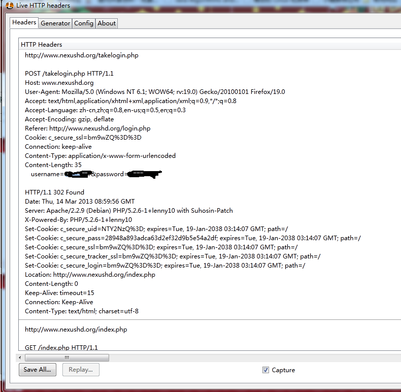

NexusHD之saythanks
======

NexusHD是校内一个高清资源分享平台，资源丰富，被它惯坏了以致再也难以忍受在线视频。很难想象没有NHD的日子啊。

在NHD种子区，对每个种子点击下“说谢谢”按钮，可以获得0.5魔力值。所以想写一个脚本把所有谢谢都说了。

要安装[**httplib2**][1]
[1]: http://code.google.com/p/httplib2/

1. 完成登录:

	+ 先对登录进行抓包

		用的是firefox的插件**Live HTTP headers**,可以看见提交了**username**、**password**两个参数，将其经过**urlencode()**转换后提交。而返回中有5条set_cookie属性，将返回的set_cookie经过一定的转换构成cookie的形式（看了后面的cookie模仿的），赋值给**headers**的**'cookie'**，那么就可以登录内部网页了。

2. 提交saythanks requset:

	+ 相似的也是post一个id到http://www.nexushd.org/thanks.php

那么可以上代码了：

<pre><code>
# -*- coding: utf-8 -*-
import urllib
import cookielib, urllib2
import re						#
import string
import time
import httplib2

cj = cookielib.CookieJar()
opener = urllib2.build_opener(urllib2.HTTPCookieProcessor(cj))

def getcook(set_cookie):
	strlist = set_cookie.split('path=/,')
	cookie = ''
	for value in strlist:
		cookie += value[:value.find('exp')]
	f = open('cookie','w')
	f.write(cookie)
	f.close()
	return cookie

http = httplib2.Http('.cache')

username = raw_input('username:')
password = raw_input('password:')

url = 'http://www.nexushd.org/takelogin.php'   
body = {
	'username': username, 
	'password': password
}
headers = {'Content-Type': 'application/x-www-form-urlencoded'}
response, content = http.request(url, 'POST', headers=headers, body=urllib.urlencode(body))

#begin to saythanks
headers['Cookie'] = getcook(response['set-cookie'])

begins = raw_input('begins:')
ends = raw_input('ends:')

for i in range(int(begins),int(ends)+1):
	body = {'id': i}
	url = 'http://www.nexushd.org/thanks.php'
	response, content = http.request(url, 'POST', headers=headers,body=urllib.urlencode(body))
	print '%d done' % i
	
</code></pre>

如果担心服务器压力可以添加

	time.sleep()