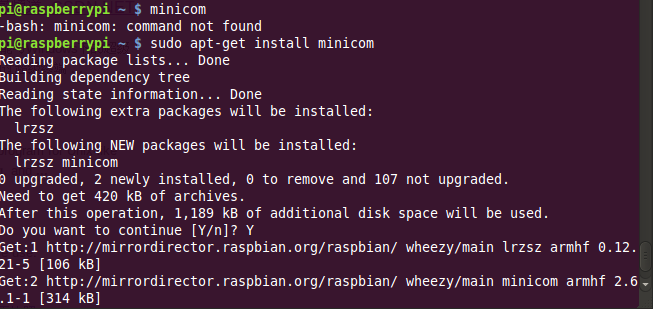
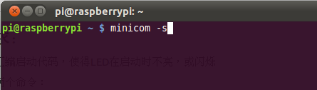
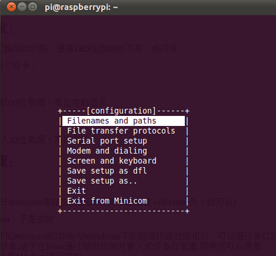

#Lab 3

	姓名：林一宇
	学号：3100102655

---

##一. 实验要求：
	
* 修改vivi的汇编启动代码，使得LED在启动时不亮，或闪烁
	
* 给vivi增加两个命令：
		
	**peek**  
		显示addr处的32位数据，高位在前显示
		
	**poke**  
		向addr处写入32位数据，高位在前

##二. 实验步骤：

###启动vivi
+ 在主机上打开minicom常按空格键(其实键入任意键 -- 除Enter外，就可以)

好吧，没有minicom，于是安装并启用

>note:Linux下的Minicom的功能与Windows下的超级终端功能相似，可以通过串口控制外部的硬件设备.适于在linux通过超级终端对嵌入式设备行管理.同样也可以使用minicom对外置Modem进行控制. 

+ download vivi.tar.gz
<http://ishare.iask.sina.com.cn/download/explain.php?fileid=11781267>

+ 编译vivi

	tar xvzf vivi.tar.gz
	cd vivi
	make menuconfig
选中Load an Alternate Configurateion File，载入默认配置文件，最后退出。
make 编译。
在这中间，运行make menuconfig会提示ncurses找不到，menuconfig 中的界面需要用到ncurses库。
    sudo apt-get install ncurses-dev 
make 编译时，我还碰到了一个小问题，我在当前用户下直接make ,提示我某几项操作没有权限，我加了sudo 后，arm-linux-gcc 找不到了，解决办法是 sudo su 后直接make 就可以了。
编译成功后，将会在vivi 下产生一个名为vivi 的二进制文件

+ 给目标板(开发板)加电/重启 
即可进入vivi命令界面

