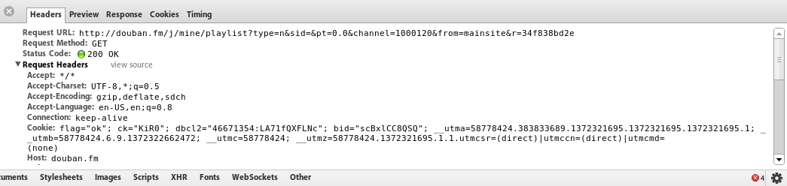
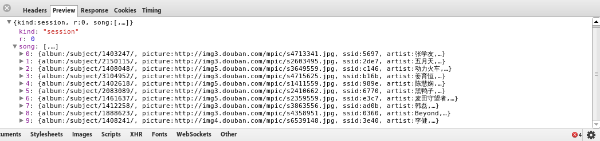
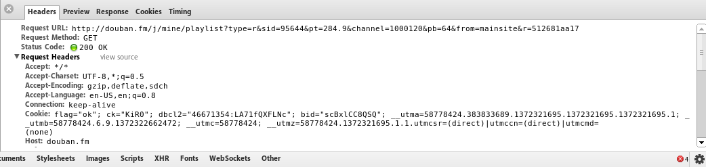
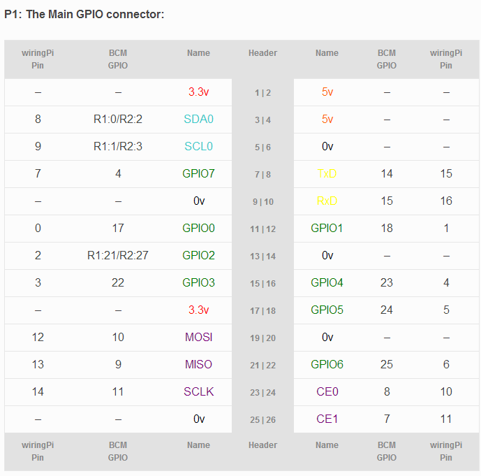

# douban FM

## 1.实验要求：
实现一个豆瓣FM的收音机，能登陆豆瓣帐号，获得音乐来播放，用五个按钮来控制：下一个频道、播放、下一首、喜 欢和不喜欢。

## 2.实验步骤：
豆瓣fm需要验证码，开始打算走先登录豆瓣再进豆瓣fm捷径但是测试了几次发现随机要求验证码。就放弃了这个功能。

安装mpg123（或者mplayer）

> mpg123 is a real time MPEG 1.0/2.0/2.5 audio player/decoder for layers 1,2 and 3 (MPEG 1.0 layer 3 aka MP3 most commonly tested). Among others working with Linux, MacOSX, FreeBSD, SunOS4.1.3, Solaris 2.5, HPUX 9.x, SGI Irix and Cygwin or plain MS Windows.
> It is free software licensed under LGPL 2.1 (the officially released sources, some files in subversion repository may differ).

#### 1. 简单播放豆瓣fm
获取列表：向/j/mine/playlist?type=n&channel=0 发送请求
其中channel是表示频道

得到的结构如下图

实现播放代码如下：

    #!/usr/bin/python
    # coding: utf-8
     
    import httplib
    import json
    import os
    import sys
    from subprocess import *
    import time
    
    # reload(sys)
    # sys.setdefaultencoding('utf-8')
    
    while True:
        # 获取播放列表
        httpConnection = httplib.HTTPConnection('douban.fm')
        httpConnection.request('GET','/j/mine/playlist?type=n&channel=0')
        song = json.loads(httpConnection.getresponse().read())['song']
    
        picture = 'images/' + song[0]['picture'].split('/')[4]
    
        # 播放
        player = Popen(['mpg123','-@', song[0]['url']],stderr=PIPE)
        output = player.stdout.readline()
        sys.stdout.write(output)
        time.sleep(song[0]['length'])
        # time.sleep(15)
        player.kill()
        
#### 2. 简单实现喜欢
要发送一个GET请求，例子结构如下

    http://douban.fm/j/mine/playlist?type=r&sid=524822&pt=3.2&channel=1000120&pb=64&from=mainsite&r=15a5c21ada

如下图：

所以部分代码如下：

    httpConnection.request('GET','/j/mine/playlist?type=r&sid=524822&pt=3.2&channel=1000120&pb=64&from=mainsite&r=15a5c21ada')

#### 3. 实现下一首
其实就是读取下playlist中下一首的播放地址

    def next(n):
        player = Popen(['mpg123','-@', song[n]['url']],stderr=PIPE)
        output = player.stdout.readline()
        sys.stdout.write(output)
        time.sleep(song[0]['length'])
        # time.sleep(15)
        player.kill()

然后加入几个键值

    import RPi.GPIO as GPIO
    import time
    import douban
    
    GPIO.setmode(GPIO.BOARD)
    
    GPIO.setup(22,GPIO.IN)
    
    while 1:
        input_value = GPIO.input(22)
        print input_value
        n = douban.play()
        time.sleep(1)
 
 
        input_value = GPIO.input(18)
        print input_value
        douban.like(n)
        time.sleep(1)
    
        input_value = GPIO.input(17)
        print input_value
        n = douban.next(n+1)
        time.sleep(1)
        
## 3.总结：
只完成了播放，喜欢，下一首部分功能