#ARM

一.实验要求以及步骤：

通过C代码和反汇编工具研究：

+ 1.生成了Thumb指令还是ARM指令，如何通过编译参数改变；

编写简单的程序，test.c并生成汇编文件。

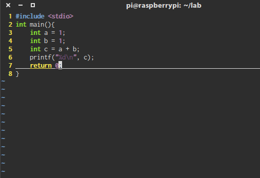

    pi@raspberrypi ~ $ gcc -c test.c
    
objdump反汇编

    pi@raspberrypi ~ $ objdump -d test.o

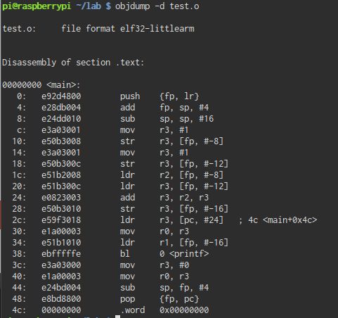

生成的汇编是32位的。是ARM指令。

使用Thumb编译

    gcc -c -mthumb -msoft-float test.c   

然后反汇编检查结果

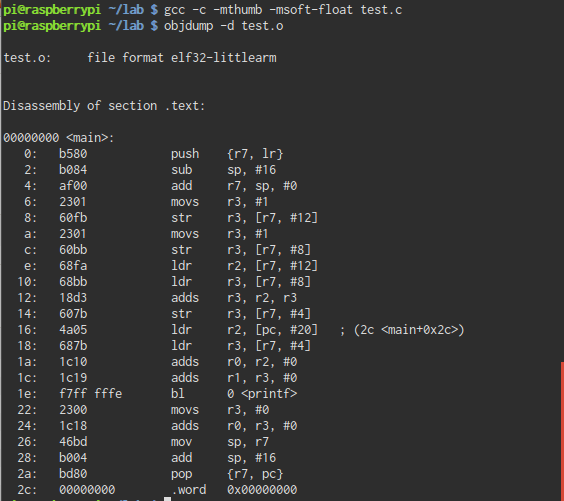

生成的汇编是16位的。是Thumb指令。

+ 2.对于ARM指令，能否产生条件执行的指令；

编写简单的程序，test2.c并生成汇编文件。

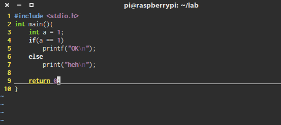

    pi@raspberrypi ~ $ gcc -c test2.c
    
objdump反汇编

    pi@raspberrypi ~ $ objdump -d test2.o
    
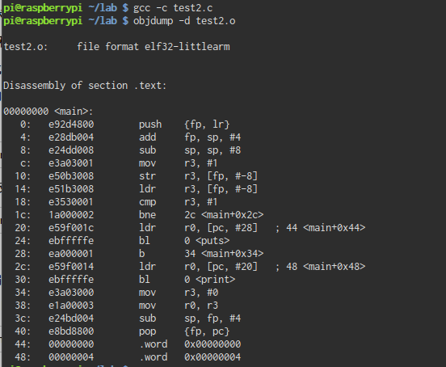

可见可以产生条件执行的指令。

+ 3.设计C的代码场景，观察是否产生了寄存器移位寻址；

编写简单的程序，test3.c并生成汇编文件。

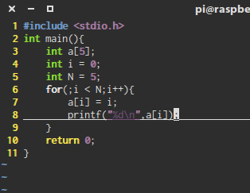

    pi@raspberrypi ~ $ gcc -c test3.c
    
objdump反汇编

    pi@raspberrypi ~ $ objdump -d test3.o
    
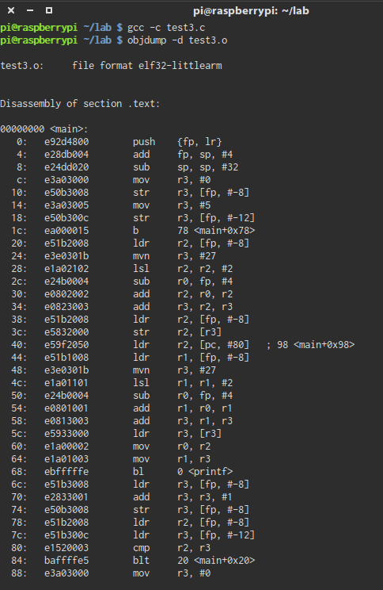
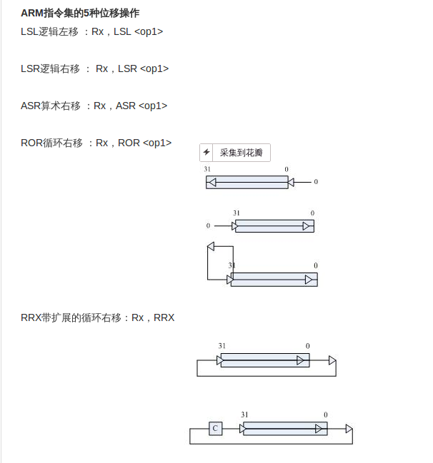

可以看到移位寻址指令。

+ 4.设计C的代码场景,观察一个复杂的32位数是如何装载到寄存器的;

编写简单的程序，test4.c并生成汇编文件。

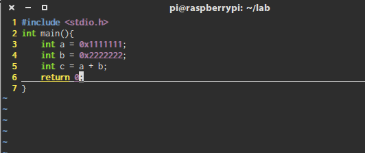

    pi@raspberrypi ~ $ gcc -c test4.c
    
objdump反汇编

    pi@raspberrypi ~ $ objdump -d test4.o
    

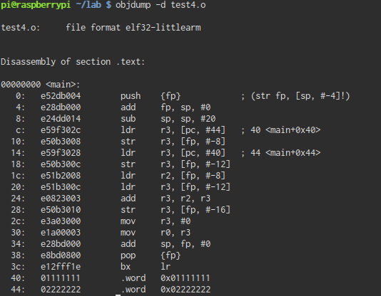
    
通过代码
    
    c:    e59f302c 	ldr	r3, [pc, #44]	; 40 <main+0x40>
    10:	e50b3008 	str	r3, [fp, #-8]
    14:	e59f3028 	ldr	r3, [pc, #40]	; 44 <main+0x44>
    18:	e50b300c 	str	r3, [fp, #-12]
    
取得在

    40:	01111111 	.word	0x01111111
    44:	02222222 	.word	0x02222222

的32位数。

+ 5.写一个C的多重函数调用的程序，观察和分析:

编写简单的程序，test5.c并生成汇编文件。

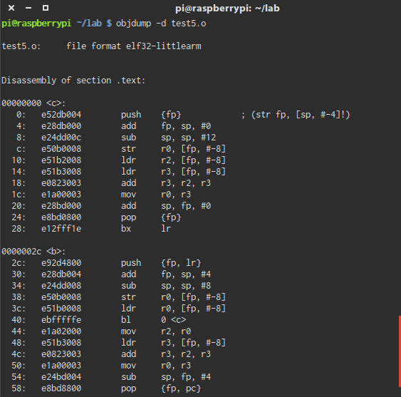
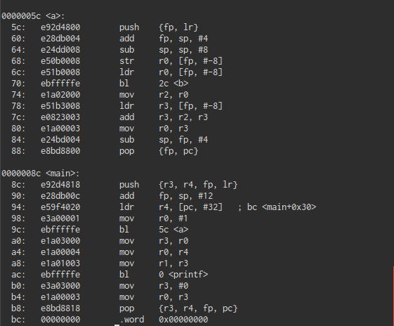

调用时的返回地址在哪里？
返回地址在lr中：
在进入调用函数中后先将返回地址push到栈中

    5c:    e92d4800 	push	{fp, lr}

然后到结束的时候pop出来

    88:    e8bd8800 	pop	{fp, pc}

传入的参数在哪里？

本例中传入的参数在r0中

本地变量的堆栈分配是如何做的？

本地变量存放在堆栈高地址，传进来的参数存放在堆栈低地址。

寄存器是caller保存还是callee保存？是全体保存还是部分保存？

R0由caller保存

+ 6.MLA是带累加的乘法，尝试要如何写C的表达式能编译得到MLA指令。

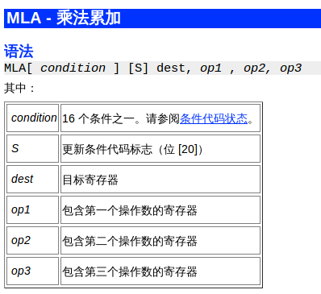

编写简单的程序，test6.c并生成汇编文件。

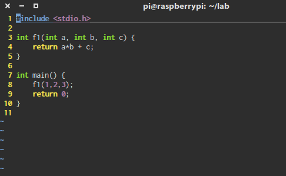

通过优化编译：
    
    gcc -c test6.c -O1
    
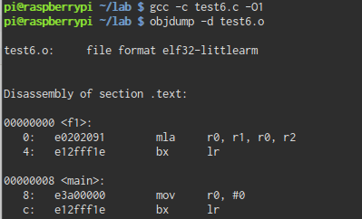

得到MLA指令