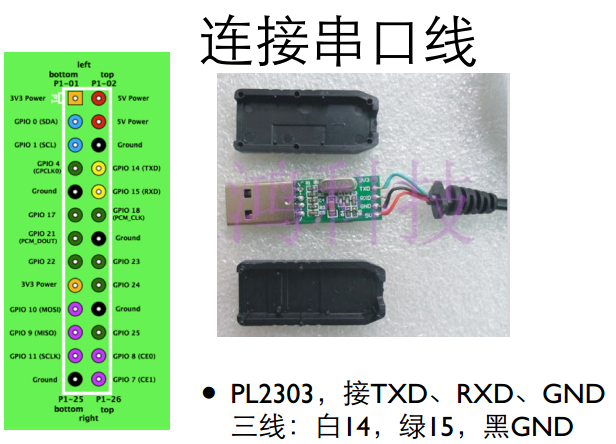
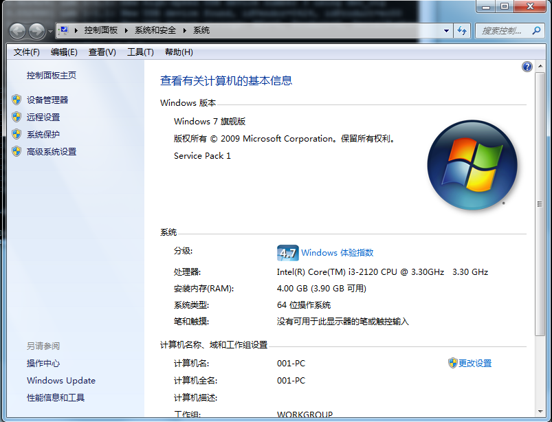
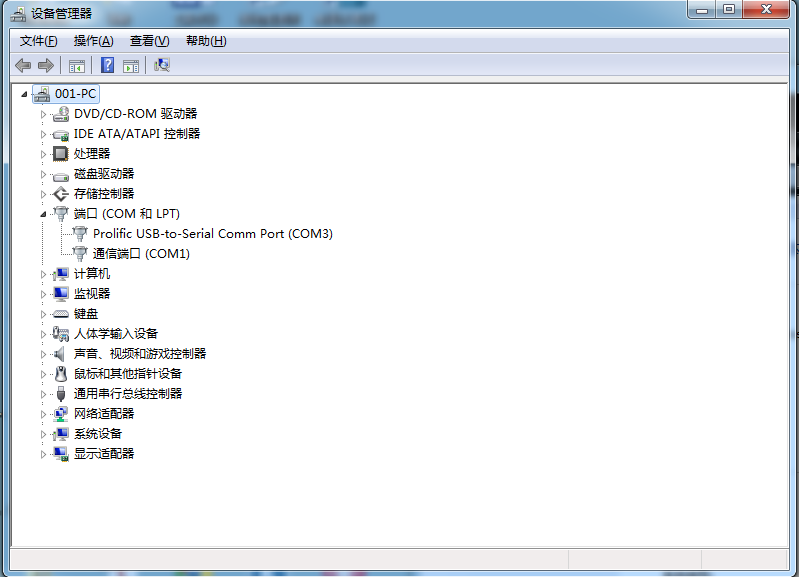
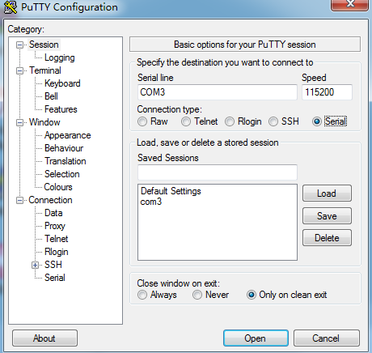
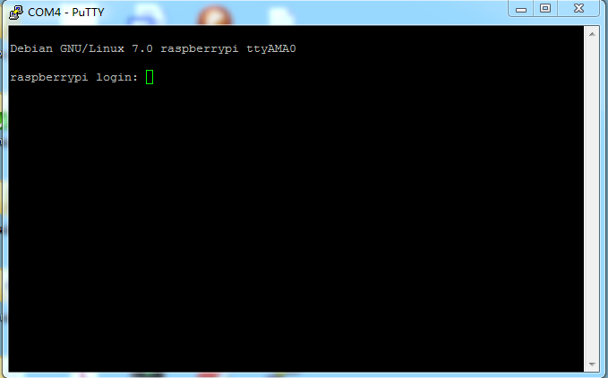
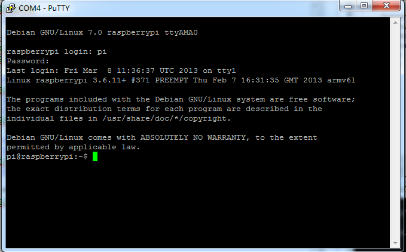
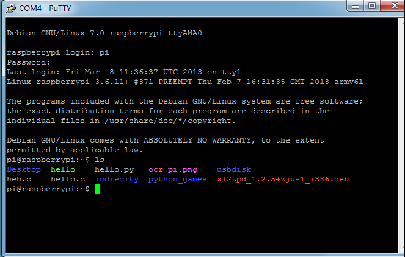
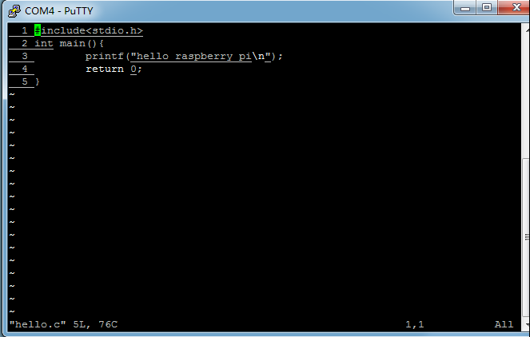
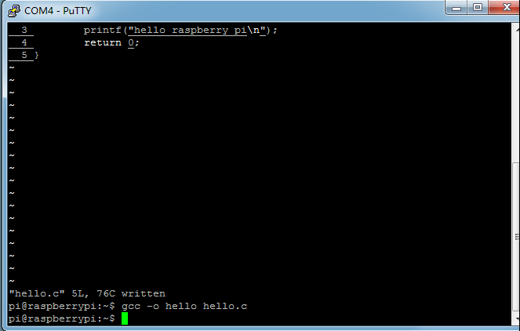
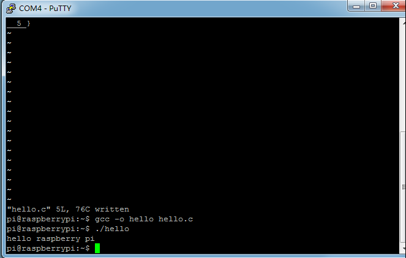

实验1：启动raspberry pi
====

	姓名：林一宇 	
	学号：3100102655

---	
##一. 实验要求：
搭好自己的树莓派。选择自己的方式连接树莓派的外设和与电脑的连接，制作详细的step by step的攻略。 建议尝试各种连接方式，包括电源、键盘、鼠标、网络、串口。

##二. 实验步骤：
1.**第一步：**

+ 准备SD卡
	+ 下载[img][1]文件
[1]: http://www.raspberrypi.org/downloads
		+ Raspbian “wheezy”
		+ Soft-float Debian “wheezy”
		+ Arch Linux ARM
		+ RISC OS
	+ 解压.zip得到.img
	+ 路径名不能含**汉字**
	+ Windows需要下载安装[Image Writer for Windows][1]用来安装SD卡
[1]: https://code.launchpad.net/win32-imagewriter
 

+ 连接串口线
>
>

+ 连接电源，上电启动
>

2.**第二步：**
	
+ 连接网络
>

3.**第三步：**

+ 给树莓派接上HDMI转DVI的连接线
>
>

+ 调节显示器的信号源
>	

+ 成功显示登录界面，然后输入帐号密码
>

+ 输入指令 $startx 进入图形界面
>

4.**第四步：**

+ 接上鼠标和键盘
>

5.**第五步：**

+ 通过串口显示
	+ 安装串⼝驱动（windows自动安装）
		
		+ [PL2303官网][1]
[1]: http://www.prolific.com.tw/
	
+ 在Windows的硬件管理器里中找到串口
>
>

+ 安装串口终端软件
	+ Windows中使用[putty][1]
[1]: http://www.chiark.greenend.org.uk/~sgtatham/putty/download.html
>

+ 上电
>

6.**第六部:**

+ 通过输入 login：pi 和 passwd： raspberry 登录raspberrypi：
>
>

+ 编写程序 **hello.c**:
>

+ 用**GCC**编译程序
>

+ 运行**hello**程序
>

---

**Note**:如果不想购买转接线可以参考**FM**的博客: [徒手配树莓派][1]
[1]: http://ba5ag.blog.163.com/blog/static/21050107020131423236860/