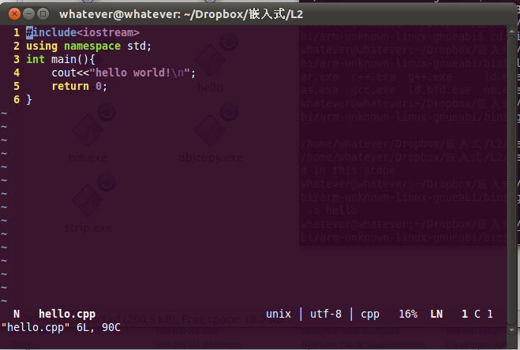
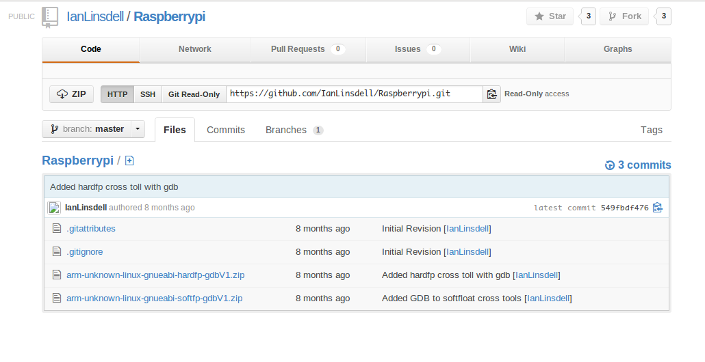
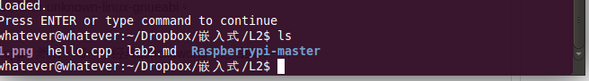
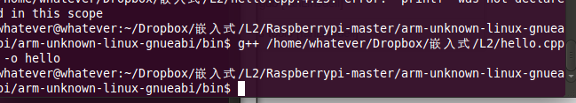

Lab 2：交叉编译
====

	姓名：林一宇
	学号：3100102655

##一. 实验要求：
在PC上（Windows、MacOS或Linux）上搭建交叉编译环境，选择自己喜欢的方式将编译结果放到树莓派上运行，运 行hello world和浮点测试程序。

+ 建议：

	+ 选择不同的OS

	+ 选择不同的与RPi连接的方式：Samba、tftp、sftp、NFS、 xmodem...

##二. 实验步骤：

+ 编写一个简单的__hello.cpp__:

+ 从<https://github.com/IanLinsdell/Raspberrypi>下载编译工具链

+ 解压到下载到的文件，会得到两个__zip__文件__arm-unknown-linux-gnueabi-hardfp-gdbV1.zip__和__arm-unknown-linux-gnueabi-softfp-gdbV1.zip__，解压__arm-unknown-linux-gnueabi-hardfp-gdbV1.zip__得到__arm-unknown-linux-gnueabi__文件夹，使用__arm-unknown-linux-gnueabi/arm-unknown-linux-gnueabi/bin/g++.exe__对__hello.cpp__进行编译

得到文件__hello__

+ 在raspberry pi上假设ftp：

我选择了vsftpd：

>1,安装vsftpd服务器 (约400KB)

>sudo apt-get install vsftpd

>2,启动ftp服务

>sudo service vsftpd start

note:配置
sudo vim /etc/vsftpd.conf

sudo service vsftpd restart

+ 通过ftp上传hello并运行

+ 中间出现了点问题，然后就会寝室用ssh远程登录

> ifconfig
> ssh pi@10.214.9.213
登录成功

＋ 重新上传
ftp 10.214.9.213
name:anonymous
password:

put hello

+ 运行hello

