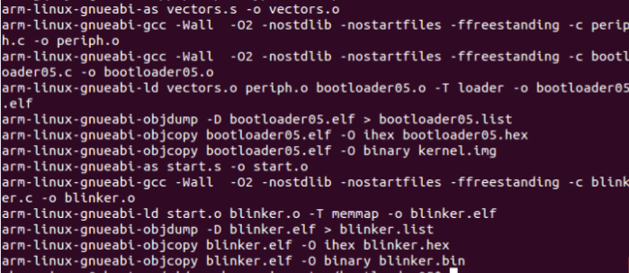
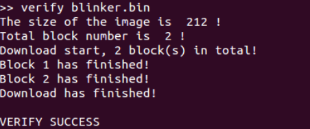
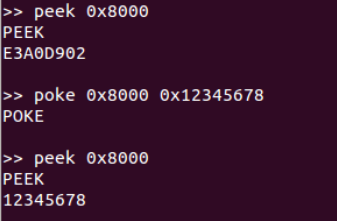
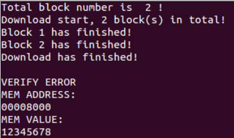

# bootloader

### 实验要求：
David Welch的 GitHub 的bootloader05给出了一个非常简单的RPi bootloader，他的代码链接在内存的0x00020000位置，一直在监听串口是否有XMODEM协议的文件下载，如果有就开始接收数据，并复制到0x00008000位置，传输完成后跳转到 0x00008000去执行。
TA写了一个Python脚本，按照下面的命令调用脚本可以下载并执行用户程序python xmodem-loader.py -p com3 -b 115200 output.bin
你的任务是修改bootloader和python脚本实现如下功能：
调用命令python xmodem-loader.py -p com3 -b 115200启动脚本并且与板卡建立串口连接，之后可以发送下面的命令。
+ load *.bin 下载程序*.bin
+ go 执行已下载的程序
+ peek addr 以一个字为单位读取内存中addr位置的数据（addr是4字节对齐，十六进行的形式，长度为8，例如 0x00008000），并以十六进制的形式输出
+ poke addr data 以一个字为单位修改内存中addr位置的数据为data（addr是4字节对齐，十六进行的形式，长 度为8， data也是十六进行的形式，长度为8）
+ verify *.bin 验证已下载的程序和*.bin是否完全相同。

### 实验步骤：
#### 1.下载 bootloader 源文件
下载地址:https://github.com/dwelch67/raspberrypi

#### 2.修改 bootloader 的源代码和 Python 脚本的代码
需要修改的文件有 bootloader05.c、vectors.s(位于 bootloader05 文件夹中)和xmodem-loader.py,修改后文件内容在附件中。

#### 3.在 bootloader05 的 Makefile 文件里修改交叉编译工具,将第一行修改为
    
    ARMGNU ?= arm-linux-gnueabi

#### 4.对 bootloader05 进行编译

#### 5.用编译完成后的 kernel.img 文件替换树莓派 SD 卡中的 kernel.img 文件。
将树莓派上电连接在 PC 机上,运行 Python 脚本进行测试。

演示结果：

LOAD:

Verify:

Peek poke:

Go:
