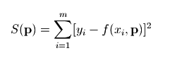

最小二分法
====

假设有一组实验数据(x[i], y[i])，我们知道它们之间的函数关系:y = f(x)，通过这些已知信息，需要确定函数中的一些参数项。例如，如果f是一个线型函数f(x) = k*x+b，那么参数k和b就是我们需要确定的值。如果将这些参数用 p 表示的话，那么我们就是要找到一组 p 值使得如下公式中的S函数最小：

S(\mathbf{p}) = \sum_{i=1}^m [y_i - f(x_i, \mathbf{p}) ]^2

这种算法被称之为最小二乘拟合(Least-square fitting)。

###最小二乘法 
####1.设经验
方程是y=F(x)，方程中含有一些待定系数an，给出真实值{(xi,yi)|i=1,2,...n},将这些x,y值代入方程然后作
差，可以描述误差：yi-F(xi)，为了考虑整体的误差，可以取平方和，之所以要平方是考虑到误差可正可负直接相加可以相互抵消，所以记误差为：

    e=∑(yi-F(xi))^2

它是一个多元函数，有an共n个未知量，现在要求的是最小值。所以必然满足对各变量的偏导等于0，于是得到n个方程：

    de/da1=0
    de/da2=0
    ...
    de/dan=0

n个方程确定n个未知量为常量是理论上可以解出来的。用这种误差分析的方法进行回归方程的方法就是最小二乘法。

####2.线性回归
如果经验方程是线性的，形如y=ax+b，就是线性回归。按上面的分析，误差函数为：

    e=∑(yi-axi-b)^2

各偏导为：

    de/da=2∑(yi-axi-b)xi=0
    de/db=-2∑(yi-axi-b)=0

于是得到关于a,b的线性方程组：

    (∑xi^2)a+(∑xi)b=∑yixi
    (∑xi)a+nb=∑yi

设A=∑xi^2,B=∑xi,C=∑yixi,D=∑yi，则方程化为：

    Aa+Bb=C
    Ba+nb=D

解出a,b得：

    a=(Cn-BD)/(An-BB)
    b=(AD-CB)/(An-BB)
     
这就是我们要进行的算法。

scipy中的子函数库optimize已经提供了实现最小二乘拟合算法的函数leastsq。

    # -*- coding: utf-8 -*-
    import numpy as np
    import pylab as pl
    from scipy.optimize import leastsq
    # x = [1, 2, 3, 4, 5]# Make an array of x values
    # y = [1, 4, 9, 16, 25]# Make an array of y values for each x value
    
    x = [-1.5, -1, -0.5, -0.2, 0, 0.2, 0.5, 1, 1.5]
    y = [-14.59, -11.42, -5.75, -2.29, -0.2, 2.32, 5.59, 11.39, 13.69]
    
    def residuals(p, y, x):
        """
        实验数据x, y和拟合函数之间的差，p为拟合需要找到的系数
        """
        return y - func(x, p)
    def fun(p, x):
        """
        定义想要拟合的函数
        """
        k, b = p  #从参数p获得拟合的参数
        return k*x+b
    
    def err(p, x, y):
        """
        定义误差函数
        """
        return fun(p,x) -y
    
    p0 = [1,1]  # 第一次猜测的函数拟合参数
    
    #将list类型转换为 numpy.ndarray 类型
    x1 = np.array(x)
    y1 = np.array(y)
    
    # 调用leastsq进行数据拟合
    # err为计算误差的函数
    # p0为拟合参数的初始值
    # args为需要拟合的实验数据
    plsq = leastsq(err, p0, args=(x1, y1))
    
    print plsq[0]
    
    pl.plot(x, y)# use pylab to plot x and y
    pl.plot(x, y, 'or')
    z = [ele * plsq[0][0] + plsq[0][1] for ele in x]
    pl.plot(x, z)
    pl.show()# show the plot on the screen
 
**REFER**   
[最小二乘法](http://zh.wikipedia.org/wiki/%E6%9C%80%E5%B0%8F%E4%BA%8C%E4%B9%98%E6%B3%95)
[SciPy-数值计算库](http://cfa.everpcpc.com/scipy-doc/scipy_intro.html)